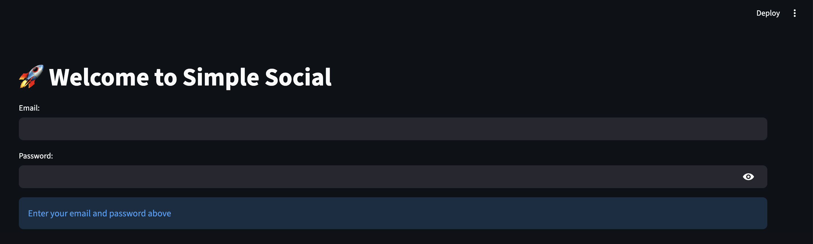
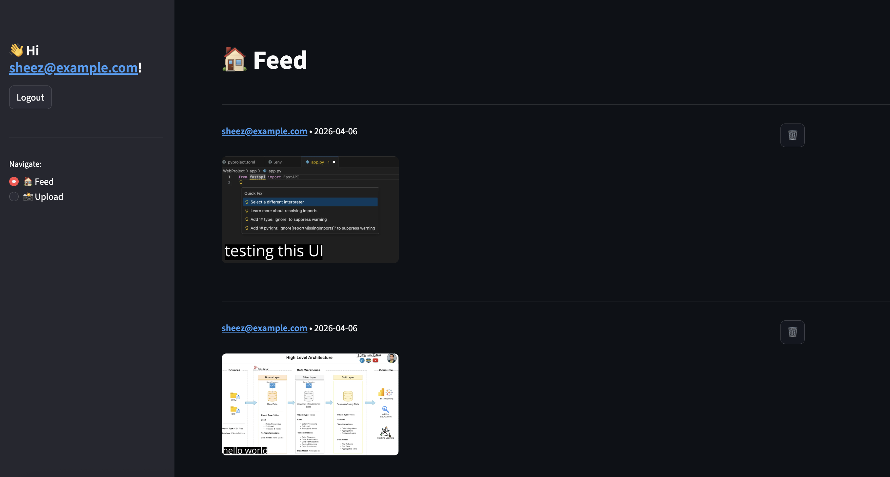
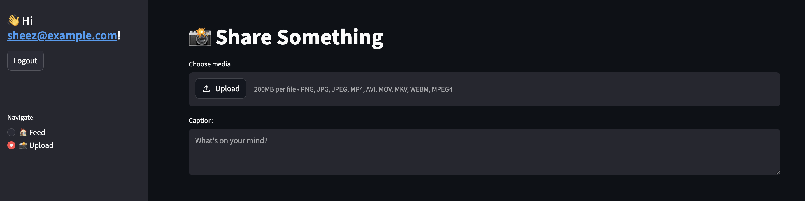

# 🚀 Simple Social Media App

[](https://www.python.org/)
[](https://fastapi.tiangolo.com/)
[](https://streamlit.io/)
[](https://www.sqlite.org/)

A lightweight social media application built with **FastAPI** for the backend and **Streamlit** for the frontend. Users can register, login, upload images or videos with captions, view a feed of posts, and delete their own posts.  

FastAPI is used extensively for:
- **JWT-based authentication** (FastAPI Users)
- **Async database operations** with SQLAlchemy and SQLite
- **Media uploads and transformations** via ImageKit
- **RESTful endpoints** for posts and feeds


---

## Table of Contents
- [Project Overview](#project-overview)
- [Features](#features)
- [Tech Stack](#tech-stack)
- [Screenshots](#screenshots)
- [Project Structure](#project-structure)
- [Getting Started](#getting-started)
- [Usage](#usage)
- [Future Improvements](#future-improvements)

---

## Project Overview
This project demonstrates a full-stack social media platform with **FastAPI at its core**. Users can:
- Register and login with JWT authentication
- Upload images and videos (stored and transformed via ImageKit)
- View a feed of all posts in reverse chronological order
- Delete their own posts

The goal is to showcase **FastAPI’s capabilities** for authentication, database handling, async operations, and API creation.


---

## Features
- **User Management**
  - Sign-up, login, password reset, and email verification
  - JWT-based authentication
- **Posts**
  - Upload images and videos with captions
  - Posts stored in **SQLite** database
  - Posts associated with users (one-to-many relationship)
- **Feed**
  - Fetch all posts in reverse chronological order
  - Display posts with media previews and captions
  - Delete posts (if the current user is the owner)
- **Media Handling**
  - Uploads stored via **ImageKit**
  - Images can have caption overlays using URL transformations
- **Frontend**
  - Built with **Streamlit**
  - Login, feed view, and upload page integrated
  - Logout functionality and sidebar navigation

---

## Tech Stack
- **Backend:** FastAPI  
- **Database:** SQLite with SQLAlchemy ORM  
- **Authentication:** FastAPI Users (JWT)  
- **Media Storage & Transformation:** ImageKit  
- **Frontend:** Streamlit  
- **Python Version:** 3.11+  

---

## Screenshots
### Login / Registration


### Feed View


### Upload Page


---

## Project Structure 
```text
app/
├── app.py           # Main FastAPI app with endpoints
├── db.py            # Database models and session management
├── images.py        # ImageKit integration for uploads
├── schemas.py       # Pydantic schemas for validation
├── users.py         # User authentication and management
frontend.py          # Streamlit frontend for interacting with API

```
---

## Getting Started

Follow these steps to set up and run the project locally:

### 1. Clone the repository
```bash
git clone <repository-url>
cd <repository-folder>
```

### 2. Install dependencies
```bash
pip install -r requirements.txt
```

### 3. Set up environment variables

Create a .env file in the root folder:
```bash
IMAGEKIT_PRIVATE_KEY=<your_imagekit_private_key>
IMAGEKIT_PUBLIC_KEY=<your_imagekit_public_key>
IMAGEKIT_URL=<your_imagekit_url_endpoint>
```

### 4. Run the FastAPI backend
```bash
uvicorn app.app:app --reload
```

### 5. Run the Streamlit frontend
```bash
streamlit run frontend.py
```

## Usage
- Open the Streamlit frontend: http://localhost:8501
- Register or login with your email and password
- Upload images/videos with captions on the Upload page
- View all posts on the Feed page
- Delete posts you own using the delete button

## Future Improvements (FastAPI-focused)
- Add pagination and filtering to feed API
- Implement likes, comments, and reactions using REST endpoints
- Enable real-time updates with WebSockets or Server-Sent Events (SSE)
- Add cloud database support (PostgreSQL/MySQL) for production
- Enhance media validation and transformations in FastAPI
- Implement rate limiting and improved security for endpoints
- Add API documentation improvements (Swagger UI and OpenAPI enhancements)
- Optional: Implement admin dashboard for post management

---